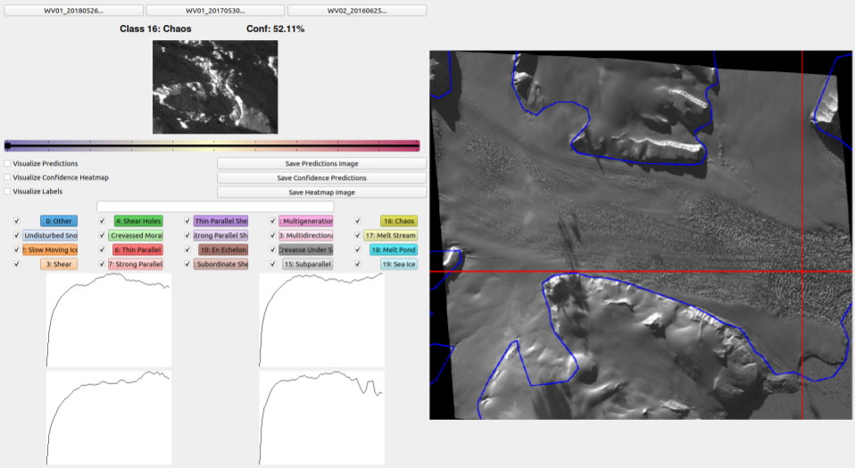
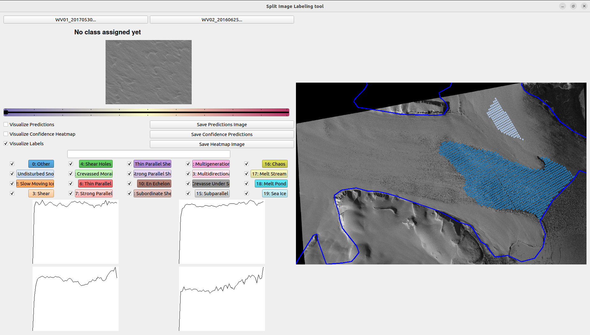

# NN_Class User Guide and Documentation

The following is a guide for installing and running the NN_Class software, along with a comprehensive documentation of its features and instructions for how to expand its functionality. The tool and accompanying scripts which make up this repository are suitable for applications in which it is desirable to characterize and classify different sub-regions within large [GeoTIFF images](https://en.wikipedia.org/wiki/GeoTIFF), especially in cases when pre-existing labelled training datasets are not available. The example use-case outlined in this guide consists of classifying glacier surface types from [WorldView](https://www.satimagingcorp.com/satellite-sensors/worldview-2/) images using a Variogram-based Naural Network Classification Model. When using this repository, please report any bugs by [submitting an issue](https://github.com/Herzfeld-Lab/NN_Class/issues/new) with a description of the bug, along with your operating system/version and any relevant screenshots or terminal output.

# Table of Contents

- [Installation](#installation)
  * [Operating System](#operating-system)
  * [Required Packages](#required-packages)
  * [NN_Class Installation](#nn_class-installation)
- [Configuration](#configuration)
  * [Setting up the Config Folder](#setting-up-the-config-data-folder)
  * [Setting up the Data Folder](#setting-up-the-data-folder)
  * [Config Parameters](#config-parameters)
    + [Model Parameters](#model-parameters)
    + [Dataset Parameters](#dataset-parameters)
    + [Training Parameters](#training-parameters)
    + [Data Augmentation Parameters](#data-augmentation-parameters)
    + [Visualization Parameters](#visualization-parameters)
- [Datasets](#datasets)
  * [Creating a Dataset](#creating-a-dataset)
  * [Labeling Training Data](#labeling-training-data)
    + [Individual Labeling](#individual-labeling)
    + [Batch Labeling](#batch-labeling)
    + [Visualizing Labels](#visualizing-labels)
    + [Dataset Output](#dataset-output)
- [Training](#training)
  * [Training Options](#training-options)
  * [Training Output](#training-output)
- [Testing](#testing)
  * [Testing Options](#testing-options)
  * [Testing Output](#testing-output)
- [Visualizing](#visualizing)
  * [Loading Test Output](#loading-test-output)
  * [Visualizing Classifications](#visualizing-classifications)
  * [Visualizing Confidence](#visualizing-confidence)
  * [Visualization Options](#visualization-options)
  * [Saving Classification Figures](#saving-classification-figures)
  * [Adding Classifications to Training Data](#adding-classifications-to-training-data)
- [Miscellaneous Features](#miscellaneous-features)
  * [Generating a Contour File](#generating-a-contour-file)
- [Documentation for Provided Classification Models](#documentation-for-provided-classification-models)
  * [VarioMLP](#variomlp)
  * [Resnet18](#resnet18)
- [Expanding Functionality](#expanding-functionality)
  * [Adding Classification Models](#adding-classification-models)
  * [Adding Data Augmentation Methods](#adding-data-augmentation-methods)
  * [Adding Source Data Types](#adding-source-data-types)

# Installation
## Operating System
The NN_Class software is meant to run on UNIX-based operating systems, primarily MacOS and Ubuntu. It has been tested on the following systems:
- MacOS 10.14 "Mojave"
- MacOS 10.15 "Catalina"
- Ubuntu 18.04 "Bionic Beaver"
- Ubuntu 20.04 "Focal Fossa"

It may be possible to run this software on Windows using the [Windows Linux Subsystem](https://docs.microsoft.com/en-us/windows/wsl/install-win10), but this will likely require some debugging on the user's part.

**Note:** Installing and using this software requires basic beginner-level knowledge of using UNIX terminal commands. If you are running Ubuntu, you are likely already familiar with basic terminal commands. If you are running MacOS and have not used the terminal, [here is a basic guide](https://www.makeuseof.com/tag/beginners-guide-mac-terminal/)
## Required Packages
Before setting up the repository, make sure you have python 3.x, pip and git installed on your machine. These should be installed on your machine by default. To check your version of python/pip and upgrade if necessary, follow [this guide for Ubuntu](https://phoenixnap.com/kb/how-to-install-python-3-ubuntu) or [this guide for MacOS](https://opensource.com/article/19/5/python-3-default-mac). For git, follow [this guide](https://git-scm.com/book/en/v2/Getting-Started-Installing-Git)
## NN_Class Installation
To download the repository, open up a terminal and navigate to the directory in which you want this repository to live. Then, run:

```
git clone https://github.com/Herzfeld-Lab/NN_Class.git
```

If you don't have an ssh key for github set up on your machine, it will ask for your github username and password in the terminal. If you want to set up an ssh key to make things easier in the future, you can follow the tutorial [here](https://help.github.com/en/github/authenticating-to-github/connecting-to-github-with-ssh)

Once it's finished downloading, navigate into the `NN_Class` directory and run the install dependencies script:

```
cd NN_Class
./install_dependencies.sh
```

This will probably take some time.
# Configuration
Within the top-level project directory, there are 3 main sub-directories that the user will interact with. First, the `NN_Class/Config/` directory, which contains configuration parameters for the classification model, training algorithm and dataset. Second is the `NN_Class/Data/` directory, which contains the GeoTIFF images which comprise a dataset. Lastly, the `NN_Class/Output/` directory contains output from the training, testing and visualization scripts in the form of model checkpoints, classification results and figures.
## Setting up the Data Folder
Each GeoTIFF image dataset should have its own sub-directory in `NN_Class/Data`. This directory should contain one or more GeoTIFF-formatted images that all contain data from the same [UTM Zone](https://en.wikipedia.org/wiki/Universal_Transverse_Mercator_coordinate_system). For the example project followed in this guide, a `Data/Negri_WV` directory was created, which contains 5 GeoTIFF images of the Negribreen Glacier taken by the WorldView-1 and WorldView-2 satellites.
## Setting up the Config Folder
Each individual classification project should have its own sub-directory in `NN_Class/Config`. At a minimum, this directory should contain:
1. A YAML-formatted `.config` file which defines all necessary parameters and filepaths for the classification task (described in detail below)
2. A `.npy`-formatted 'contour' file containing a list of UTM coordinates which define the boundaries of the area-of-interest for the classification task.

There is an example Config folder with the above files included in `NN_Class/Config/mlp_test_negri`, which contains the configuration for classifying surface types of the Negribreen Glacier from WorldView GeoTIFF images. The easiest way to set up your own project is to copy this folder, and change the necessary parameters. In order to create your own area-of-interest contour file, skip to the [Generating a Contour File](#generating-a-contour-file) section before proceeding with the rest of this tutorial.
## Config Parameters
The YAML-formatted `.config` file contains all of the configuration parameters for a classification task. To create your own config file, simply copy the example provided in `NN_Class/Config/mlp_test_negri/mlp_test_negri.config` and change the parameters to fit your task. The config file must have the exact format provided in the example file for the NN_Class software to work. The parameters in the config file are split into 5 categories, which are defined as follows:
### Model Parameters
The model parameters define the hyperparameters of the classification model. Some of these parameters are only relevant to the provided VarioMLP model, implemented in `Models/VarioMLP.py`. For the other provided Resnet18 model (implemented in `Models/Resnet18.py`), set these parameters to `None`.
- `model`:          This defines which Neural Network model to be used. The example project uses VarioMLP.
- `num_classes`:    The number of classes to be used. For this tutorial, only 2 classes will be used
- `vario_num_lag`:  (VarioMLP-only) The number of lag values to be used in the directional Variogram during preprocessing for the VarioMLP model
- `hidden_layers`:  (VarioMLP-only) The shape of the hidden layers of the VarioMLP network. Detailed description provided [here](#variomlp)
- `activations`:    The activation functions used in the neural network's hidden layers (right now, only [ReLU](https://machinelearningmastery.com/rectified-linear-activation-function-for-deep-learning-neural-networks/) is supported)
### Dataset Parameters
### Training Parameters
### Data Augmentation Parameters
### Visualization Parameters
# Datasets
## Creating a Dataset

## Labeling Training Data

### Individual Labeling

### Batch Labeling


### Visualizing Labels
### Dataset Output
# Training
## Training Options
## Training Output


# Testing
## Testing Options
## Testing Output

# Visualizing
## Loading Test Output
## Visualizing Classifications

## Visualizing Confidence

## Visualization Options

## Saving Classification Figures

## Adding Classifications to Training Data


# Miscellaneous Features
## Generating a Contour File
# Documentation for Provided Classification Models
## VarioMLP
## Resnet18
# Expanding Functionality
## Adding Classification Models
## Adding Data Augmentation Methods
## Adding Source Data Types


First, make sure you have both python3, pip and git installed on your machine, this will probably already be the case.

To download the repository, open up a terminal and navigate to the directory you want this project to live. Then, run

```
git clone https://github.com/Herzfeld-Lab/NN_Class.git
```

If you don't have an ssh key for github set up on your machine, it will ask for your github username and password in the terminal. If you want to set up an ssh key to make things easier in the future, you can follow the tutorial [here](https://help.github.com/en/github/authenticating-to-github/connecting-to-github-with-ssh)

Once it's finished downloading, navigate into the `NN_Class` directory and run the install dependencies script

```
cd NN_Class
./install_dependencies.sh
```

This might take some time.

**Note:** I probably missed adding some dependencies to this script. If you run into a dependency problem later on please submit an issue for it and I'll add it

## Getting Test Data

To get the test data for this tutorial, sftp into Snowdon and download `/Volumes/yosemite3/backup/jackh/Data`. Place this Data folder in the `NN_Class` directory. This will probably take a minute to download since the tiff image is large.

## Configuring the test

The way this repository is designed, each individual classification project will have its own folder in `NN_Class/Config`, whic contains everything needed for the project. Namely, this folder contains a YAML-format `.config` file which defines all the parameters necessary to train and test the neural network, visualize and label split images, tune network hyperparameters and define image preprocessing steps. I've included an example config file for this test run in `NN_Class/Config/mlp_test_negri/mlp_test_negri.config`. Open up this file in a text editor so we can fill out a few lines. Here is a brief description of the configuration parameters:

### Model Parameters:

- `model`:          This defines which Neural Network model to be used. We are using VarioMLP, defined in `VarioMLP.py`
- `num_classes`:    The number of classes to be used. We will start with just 2 classes for this test.
- `vario_num_lag`:  The number of lag values to be used in the directional Variogram during preprocessing
- `hidden_layers`:  The shape of the hidden layers of the MLP network. Detailed description provided [here](#model-descriptions)
- `activations`:    The activation functions used in the network's hidden layers (right now, only ReLU is implemented)

### Dataset Parameters:

- `img_path`:         The filepath to the geotiff image to be classified.
- `txt_path`:         The filepath to the .npy file containing all the split image data
- `train_path`:       Deprecated - used only to load split images in the old matlab format (file heirarchy with .png)
- `valid_path`:       Deprecated - used only to load split images in the old matlab format (file heirarchy with .png)
- `class_enum`:       A list of class names, of length `num_classes`.
- `utm_epsg_code`:    EPSG code of the UTM zone the geotiff image is within (33N for Negribreen)
- `split_img_size`:   Size of split images, in pixels (This will be changed to UTM in the next release)
- `train_test_split`: Percentage of images to be kept as training images (0.8 == 80%), the rest are used for testing

### Training Parameters:

- `use_cuda`:       If true, utilizes GPU for training and testing. Requires extra setup
- `num_epochs`:     Maximum number of epochs to run the training loop
- `learning_rate`:  Initial learning rate for the optimizer
- `batch_size`:     Number of split images to be passed through network before each iteration of the backpropagation
- `optimizer`:      Optimization algorithm to be used during training

### Data Augmentation Parameters:

- `directional_vario`:    Whether to use directional variogram on split images (Always true unless using a CNN model)
- `random_rotate`:        Randomly rotate via variogram before feeding into network
- `random_shift`:         Randomly shift area to perform variogram over (if the split images are not squares)
- `random_contrast`:      Randomly adjust contrast (untested)
- `random_distort`:       Depracated

### Visualization Parameters:

- `contour_path`:   Filepath to list of UTM coordinates of glacier contour (.npy format)
- `bg_img_path`:    Filepath to background image to display visualizations over (depracated, scaled tiff image used instead)
- `bg_img_utm`:     Filepath to list of UTM coordinates of background image (depracated)

For this test run, I have already set up most of the paramaters in `mlp_test_negri.config`. The config file is automatically updated by various scripts to reflect changes such as adding new classes, and creating a split image dataset. To add the tiff image you just downloaded to the config file, paste it's filepath into the `img_path` parameter. This filepath can be absolute, or relative to the `NN_Class` directory, so `Data/WV02_20160625170309/WV02_20160625170309.tif` should be easiest.

## Creating Dataset

Now, it's time to split the geotiff image into a set of smaller split images that can be used for classification. This is one with the `createDatasetFromGeotiff.py` script. This script takes as an argument a `.config` file, and generates a list of split images from the geotiff that fall within the given glacier contour, and do not contain any black background sections. It saves the pixel coordinates and UTM coordinates of each split image, as well as other usefull information such as the affine transform for pixel to UTM transformations in a data structure that is utilized by the training and testing script, and the labeling and visualization tool. To create a split image dataset, run

```
python3 createDatasetFromGeotiff.py Config/mlp_test_negri/mlp_test_negri.config
```

After it's done, open up `mlp_test_negri.config` again. You will see that the `txt_path` parameter has been automatically filled to point to the newly created split image dataset file.

## Labeling Images with Split Tool

Viewing and Labeling split images and classification labels is done with the Split Image Explorer tool. To load our new split image dataset with the tool, run

```
python3 Split_Image_Explorer.py Config/mlp_test_negri/mlp_test_negri.config
```

It will take some time to load up as it loads in the geotiff image and initializes the UI, but when it's done you should see a window like this:


The right side of the window shows a preview of the geotiff image, with the glacier contour overlaid as well as a crosshairs pinpointing the location of the split image shown on the left side. You can navigate around the geotiff image preview by clicking in the desired location, or using the 'a' and 'd' keys on your keyboard to move one split image at a time.

**Note:** If there's some offset between where you click and where the crosshairs actually move, try minimizing and then maximizing, or maximizing and then minimizing the window, sometimes it boots up to the wrong size initially. I'm working on a fix for it, but I've tested it on both MacOS and Ubuntu and with some finagling it seems to work. If not, submit an issue for it with a screenshot and you OS.

Note the two buttons near the bottom corresponding to the two classes defined in `mlp_test_negri.config`, 'Undisturbed Snow' and 'Other'. Split images can be labeled either by clicking these buttons, or by pressing the number key on your keyboard corresponding to a class (in this case, 0 for Undisturbed Snow and 1 for Other).

Start off by labeling some undisturbed snow images. You can do this pretty rapidly from where the crosshair initializes by just pressing 0-d-0-d-0-d-0-d over and over again. Then, click into a few areas of the image preview that are not undisturbed snow, and repeat the process (1-d-1-d-1-d-1-d...). It should only take a minute or two until you've labeled about 100 of each. After labeling, toggle the 'Visualize Labels' checkbox to see the images you've labeled. After labeling a bunch of Undisturbed Snow in the top corner, and a few stripes of Other in the crevassed areas this is what my preview looked like:


Here dark blue and light blue correspond to Undisturbed Snow and Other respectively (I will be fleshing out the color coding in a future commit). To save your labels, simply close the Split Image Explorer window.

## Training

Now that we have some labels, it's time to do a basic training run with our Neural Network model. The `train.py` script takes as an argument a `.config` file and takes care of the whole process.

```
python3 train.py Config/mlp_test_negri/mlp_test_negri.config
```

After some time loading, you will begin to see printouts of the training and validation loss after each epoch.

**Note:** Right now this training script is extremely memory-intensive. I'm working on a fix that will roughly cut the memory usage in half, but if you have an older computer that only has like 8GB of RAM it's going to slow it way down, especially if there's a lot of other stuff open.

You can stop the training whenever you feel like it using crtl+c in the terminal, or let it run the full 100 epochs. Either way, checkpoints will be saved when the validation loss reaches a new minimum. Once the training has been ended, check the `NN_Class/Output` directory. You will see a folder named with a timestamp for when you started the training session. Within this folder, there is a `checkpoints`, `labels` and `losses` directory. In the `checkpoints` directory you will see the checkpoints that have been saved as your network was training. The most recent of these will be the checkpoint for which the validation loss was lowest.

## Testing

After training, any neural network checkpoint can be used to run a test classification across the whole dataset. In order to do this, the test script takes as an argument a `.config` file, and a checkpoint file specified with the `--load_checkpoint` parameter. For me, the command looked like this

```
python3 test.py Config/mlp_test_negri/mlp_test_negri.config --load_checkpoint Output/01-05-2020_23\:26/checkpoints/epoch_57
```

But the argument for `--load_checkpoint` will be different for you. When complete, the test script generates labels based on the trained model checkpoint in the `Output/[your timestamp here]/labels` directory. The file generated from my command above was `Output/01-05-2020_23\:26/labels/labeled_epoch_57.npy`

## Vizualizing

We can visualize the labels predicted by the neural network using the Split Image Explorer tool. To view labels generated by a training checkpoint run the tool as before, with the additional `--load_labels` argument. For me, this was

```
python3 Split_Image_Explorer.py Config/mlp_test_negri/mlp_test_negri.config --load_labels Output/02-05-2020_13\:17/labels/labeled_epoch_57.npy
```

Using the Visualize Labels checkbox, the labels can be seen. Here is what mine looked like:


The slider represents a minimum confidence threshold on a scale from 0% to 100% for visualizing labels. When the Visualize Labels checkbox is toggled, only split images with a confidence greater than the value set by the slider are shown.

**Note:** The Visualize Checkbox must be un toggled and re toggled any time a change is made in order for the preview to update.

If you want to add an additional class, simply type the class name in the text box under the slider and press enter. The new class will be created, and a new button and checkbox will be generated for it. It will also be mapped to the corresponding number key for labeling. When the Split Image tool is closed, these changes will be reflected in the `num_classes` and `class_enum` parameters in the config file, so retraining the network with new classes remains extremely simple.

## Next

If you have the time, try playing around with parameters in the config file such as the batch size and hidden layers of the network. Try creating new classes and retraining, and visualizing the results. Please try to break whatever you can, and submit an issue of what you broke and how so I can address bugs.
