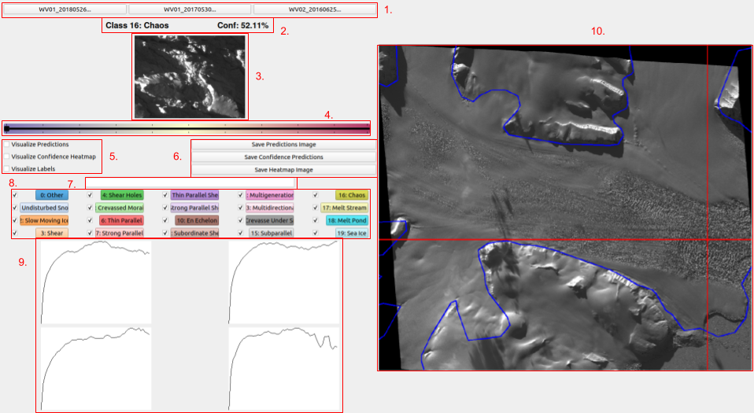
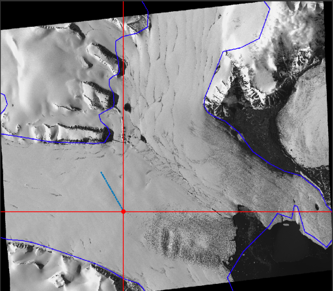
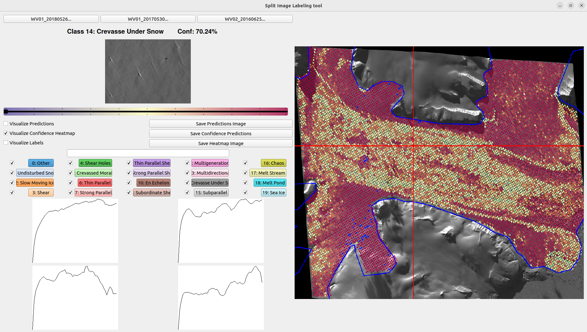
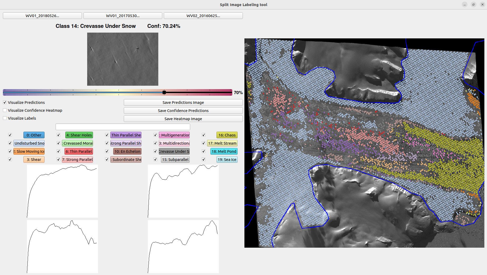
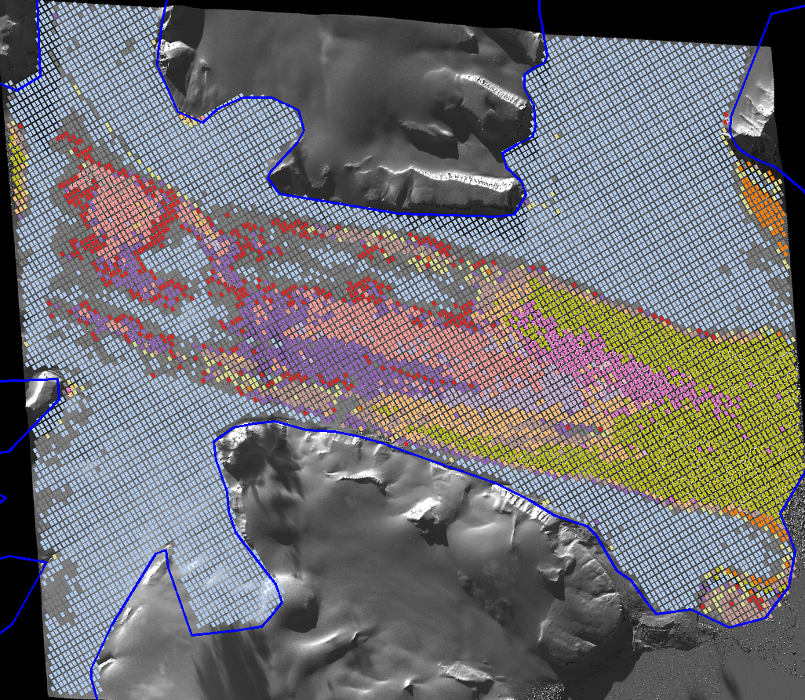
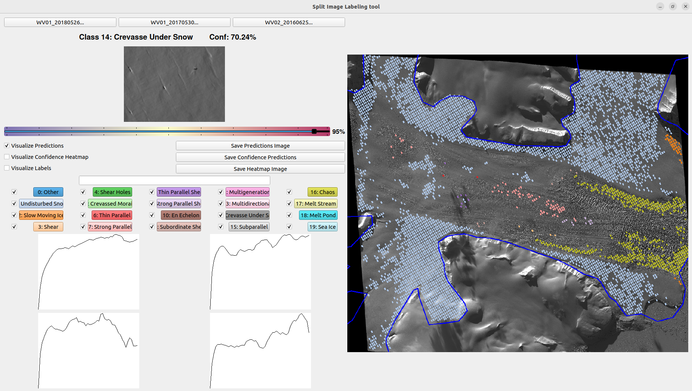
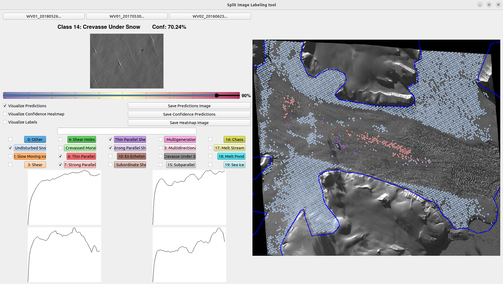

# NN_Class User Guide and Documentation

The following is a guide for installing and running the NN_Class software, along with a comprehensive documentation of its features and instructions for how to expand its functionality. The tool and accompanying scripts which make up this repository are suitable for applications in which it is desirable to characterize and classify different sub-regions within large [GeoTIFF images](https://en.wikipedia.org/wiki/GeoTIFF), especially in cases when pre-existing labelled training datasets are not available. The example use-case outlined in this guide consists of classifying glacier surface types from [WorldView](https://www.satimagingcorp.com/satellite-sensors/worldview-2/) images using a Variogram-based Naural Network Classification Model. When using this repository, please report any bugs by [submitting an issue](https://github.com/Herzfeld-Lab/NN_Class/issues/new) with a description of the bug, along with your operating system/version and any relevant screenshots or terminal output.

# Table of Contents

- [Installation](#installation)
  * [Operating System](#operating-system)
  * [Required Packages](#required-packages)
  * [NN_Class Installation](#nn_class-installation)
- [Configuration](#configuration)
  * [Setting up the Config Folder](#setting-up-the-config-folder)
  * [Setting up the Data Folder](#setting-up-the-data-folder)
  * [Config Parameters](#config-parameters)
    + [Model Parameters](#model-parameters)
    + [Dataset Parameters](#dataset-parameters)
    + [Training Parameters](#training-parameters)
    + [Data Augmentation Parameters](#data-augmentation-parameters)
    + [Visualization Parameters](#visualization-parameters)
- [Datasets](#datasets)
  * [Creating a Dataset](#creating-a-dataset)
  * [Labeling Training Data](#labeling-training-data)
    + [Individual Labeling](#individual-labeling)
    + [Batch Labeling](#batch-labeling)
    + [Visualizing Labels](#visualizing-labels)
    + [Dataset Output](#dataset-output)
- [Training](#training)
  * [Training Options](#training-options)
  * [Training Output](#training-output)
- [Testing](#testing)
  * [Testing Options](#testing-options)
  * [Testing Output](#testing-output)
- [Visualizing](#visualizing)
  * [Loading Test Output](#loading-test-output)
  * [Visualizing Classifications](#visualizing-classifications)
  * [Visualizing Confidence](#visualizing-confidence)
  * [Visualization Options](#visualization-options)
  * [Saving Classification Figures](#saving-classification-figures)
  * [Adding Classifications to Training Data](#adding-classifications-to-training-data)
- [Miscellaneous Features](#miscellaneous-features)
  * [Generating a Contour File](#generating-a-contour-file)
  * [Using a GPU](#using-a-gpu)
- [Documentation for Provided Classification Models](#documentation-for-provided-classification-models)
  * [VarioMLP](#variomlp)
  * [Resnet18](#resnet18)
- [Expanding Functionality](#expanding-functionality)
  * [Adding Classification Models](#adding-classification-models)
  * [Adding Data Augmentation Methods](#adding-data-augmentation-methods)
  * [Adding Source Data Types](#adding-source-data-types)

# Installation
## Operating System
The NN_Class software is meant to run on UNIX-based operating systems, primarily MacOS and Ubuntu. It has been tested on the following systems:
- MacOS 10.14 "Mojave"
- MacOS 10.15 "Catalina"
- Ubuntu 18.04 "Bionic Beaver"
- Ubuntu 20.04 "Focal Fossa"

It may be possible to run this software on Windows using the [Windows Linux Subsystem](https://docs.microsoft.com/en-us/windows/wsl/install-win10), but this will likely require some debugging on the user's part.

**Note:** Installing and using this software requires basic beginner-level knowledge of using UNIX terminal commands. If you are running Ubuntu, you are likely already familiar with basic terminal commands. If you are running MacOS and have not used the terminal, [here is a basic guide](https://www.makeuseof.com/tag/beginners-guide-mac-terminal/)
## Required Packages
Before setting up the repository, make sure you have python 3.x, pip and git installed on your machine. These should be installed on your machine by default. To check your version of python/pip and upgrade if necessary, follow [this guide for Ubuntu](https://phoenixnap.com/kb/how-to-install-python-3-ubuntu) or [this guide for MacOS](https://opensource.com/article/19/5/python-3-default-mac). For git, follow [this guide](https://git-scm.com/book/en/v2/Getting-Started-Installing-Git)
## NN_Class Installation
To download the repository, open up a terminal and navigate to the directory in which you want this repository to live. Then, run:

```
git clone https://github.com/Herzfeld-Lab/NN_Class.git
```

If you don't have an ssh key for github set up on your machine, it will ask for your github username and password in the terminal. If you want to set up an ssh key to make things easier in the future, you can follow the tutorial [here](https://help.github.com/en/github/authenticating-to-github/connecting-to-github-with-ssh)

Once it's finished downloading, navigate into the `NN_Class` directory and run the install dependencies script:

```
cd NN_Class
./install_dependencies.sh
```

This will probably take some time.
# Configuration
Within the top-level project directory, there are 3 main sub-directories that the user will interact with. First, the `NN_Class/Config/` directory, which contains configuration parameters for the classification model, training algorithm and dataset. Second is the `NN_Class/Data/` directory, which contains the GeoTIFF images which comprise a dataset. Lastly, the `NN_Class/Output/` directory contains output from the training, testing and visualization scripts in the form of model checkpoints, classification results and figures.
## Setting up the Data Folder
Each GeoTIFF image dataset should have its own sub-directory in `NN_Class/Data`. This directory should contain one or more GeoTIFF-formatted images that all contain data from the same [UTM Zone](https://en.wikipedia.org/wiki/Universal_Transverse_Mercator_coordinate_system). For the example project followed in this guide, a `Data/Negri_WV` directory was created, which contains 5 GeoTIFF images of the Negribreen Glacier taken by the WorldView-1 and WorldView-2 satellites.
## Setting up the Config Folder
Each individual classification project should have its own sub-directory in `NN_Class/Config`. At a minimum, this directory should contain:
1. A YAML-formatted `.config` file which defines all necessary parameters and filepaths for the classification task (described in detail below)
2. A `.npy`-formatted 'contour' file containing a list of UTM coordinates which define the boundaries of the area-of-interest for the classification task.

There is an example Config folder with the above files included in `NN_Class/Config/mlp_test_negri`, which contains the configuration for classifying surface types of the Negribreen Glacier from WorldView GeoTIFF images. The easiest way to set up your own project is to copy this folder, and change the necessary parameters. In order to create your own area-of-interest contour file, skip to the [Generating a Contour File](#generating-a-contour-file) section before proceeding with the rest of this tutorial.
## Config Parameters
The YAML-formatted `.config` file contains all of the configuration parameters for a classification task. To create your own config file, simply copy the example provided in `NN_Class/Config/mlp_test_negri/mlp_test_negri.config` and change the parameters to fit your task. The config file must have the exact format provided in the example file for the NN_Class software to work. The parameters in the config file are split into 5 categories, which are defined as follows:
### Model Parameters
The model parameters define the hyperparameters of the classification model. Some of these parameters are only relevant to the provided VarioMLP model, implemented in `Models/VarioMLP.py`. For the other provided Resnet18 model (implemented in `Models/Resnet18.py`), set these parameters to `None`.
- `model`: This defines which Neural Network model to be used. The example project uses VarioMLP.
- `num_classes`: The number of classes for the classification task.
- `vario_num_lag`: (VarioMLP-only) The number of lag values to be used in the directional Variogram.
- `hidden_layers`: (VarioMLP-only) The shape of the hidden layers of the VarioMLP network. Detailed description provided [here](#variomlp).
- `activations`: The activation functions used in the neural network's hidden layers (right now, only [ReLU](https://machinelearningmastery.com/rectified-linear-activation-function-for-deep-learning-neural-networks/) is supported).
### Dataset Parameters
The dataset parameters define the filepaths and hyperparameters pertaining to the 'split image' dataset. When starting a new project, the `img_path`, `class_enum`, `utm_epsg_code`, `split_img_size` and `train_test_split` parameters should be defined. The `npy_path` parameter will be automatically filled in when [creating a dataset](#creating-a-dataset).
- `img_path`:         The path to the directory containing the GeoTIFF images in your dataset (explained [here](#setting-up-the-data-folder)).
- `npy_path`:         The filepath to the .npy file containing all the split image data (explained [here](#creating-a-dataset)).
- `train_path`:       Deprecated - used only to load split images in the old matlab format (file heirarchy with .png).
- `valid_path`:       Deprecated - used only to load split images in the old matlab format (file heirarchy with .png).
- `class_enum`:       A list of human-readable class names, of length `num_classes`.
- `utm_epsg_code`:    [EPSG code](https://epsg.io/) of the UTM zone the geotiff image is within.
- `split_img_size`:   Desired size of split images, in pixels.
- `train_test_split`: Percentage of images to be kept as training images (0.8 == 80%), the rest are used for testing.
### Training Parameters
The training parameters govern how the classification model is trained when using `train.py`. The [Training](#training) section contains a detailed description of these operations.
- `use_cuda`:       If true, utilizes GPU for training and testing. See [Using a GPU](#using-a-gpu)
- `num_epochs`:     Maximum number of epochs to run the training loop
- `learning_rate`:  Initial learning rate for the optimizer
- `batch_size`:     Number of split images to be passed through network before each iteration of the backpropagation
- `optimizer`:      Optimization algorithm to be used during training (right now, only [Adam](https://machinelearningmastery.com/adam-optimization-algorithm-for-deep-learning/) is supported)
### Data Augmentation Parameters
The data augmentation parameters define the preprocessing steps performed on the training data before being run through the classification model. An introduction to the motivations behind data augmentation and some basic techniques can be found [here](https://markku.ai/post/data-augmentation/).
- `directional_vario`:    Whether to use directional variogram on split images (Always true for VarioMLP model)
- `random_rotate`:        Randomly rotate via variogram before feeding into network
- `random_shift`:         Randomly shift area to perform variogram over (if the split images are not squares)
- `random_contrast`:      Randomly adjust contrast (untested)
- `random_distort`:       Depracated
### Visualization Parameters
The visualization parameters define how training labels and classification results are visualized when using the Split Image Explorer GUI.
- `contour_path`:     Filepath to list of UTM coordinates of contour (described [here](#setting-up-the-config-data-folder))
- `custom_color_map`: List of desired class color [hex codes](https://www.color-hex.com/) of length `num_classes`. If not specified, the matplotlib [tab20](https://matplotlib.org/3.1.1/gallery/color/colormap_reference.html) color map will be used.
- `bg_img_path`:      Filepath to background image to display visualizations over (depracated, scaled tiff image used instead)
- `bg_img_utm`:       Filepath to list of UTM coordinates of background image (depracated)
# Datasets
The Dataset object (implemented in `Dataset.py`) is the base data structure utilized by the Split Image Explorer GUI and the classification model training and testing scripts. It defines a dataset consisting of 'Split Images' taken from one or more GeoTIFF images in the same UTM Zone. Before creating a dataset, make sure you have set up a [config folder](#setting-up-the-config-folder) and a [data folder](#setting-up-the-data-folder), as described above.
## Creating a Dataset
The  `createDatasetFromGeotiff.py` script is used to create a Dataset from source GeoTIFF images. It takes as an argument the filepath to your `.config` file, and produces a `.npy` file in the same directory containing the split image data for the entire dataset. Before running `createDatasetFromGeotiff.py`, make sure the `img_path` and `contour_path` parameters have been set in your config file. For the example case, the config file was located in `Config/mlp_negri_legacy/mlp_test_negri.config`, and (as described above) the `img_path` parameter was set to `Data/Negri_WV` which contained 5 GeoTIFF images of the Negribreen Glacier. To create the dataset in this case, the command was:
```
python3 createDatasetFromGeotiff.py Config/mlp_negri_legacy/mlp_test_negri.config
```
The output is shown below:

As shown in the terminal output, 41,310 split images were created, and the dataset was output to `Config/mlp_negri_legacy/mlp_test_negri_41310_(201,268).npy`. In general the output file will be named as `{your-config-filename}_{number-of-split-images}_{split-image-size}.npy`. When checking the `.config` file, you will see the `npy_path` parameter has been filled with this filepath.
## Labeling Training Data
The first step in any classification task is to gather labeled training data. The Split Image Explorer GUI tool provides an intuitive interface for labeling split images based on the classes defined by the `num_classes` and `class_enum` parameters in the config file. To run the GUI, simply run `Split_Image_Explorer.py` with the config file as an argument, just as `createDatasetFromGeotiff.py` was run:
```
python3 Split_Image_Explorer.py Config/mlp_negri_legacy/mlp_test_negri.config
```
After a short loading process, you will be presented with a GUI window like this:

The GUI provides many useful tools for labeling and viewing split images, and understanding classification results. To start, try clicking around the geotiff image preview on the right half of the GUI, within the contour shown in blue. This allows for selecting any split image from the source geotiff based on the location of the crosshairs. Here is a breakdown of each of the components present in the GUI (each of these will be explored in detail in their respective sections):

1. Source GeoTIFF selector buttons. These buttons can be used to switch between source geotiff images for visualization/labeling split images.
2. Split Image preview. This window shows the split image at the current location of the crosshairs in the geotiff preview window.
3. This text will display the label of the current split image, or the classification and confidence if the model has been trained.
4. Confidence Slider. This slider can be used to set a confidence threshold for visualizing classifications.
5. Visualization toggles. These toggles can be used to switch between visualizing training labels, classification labels, or classification confidence values in the geotiff preview window.
6. Output buttons. These buttons can be used to save images of the classification or confidence values.
7. New Class field. If a new class is needed, type its name in this field and press enter. The config class buttons, toggles and config file will be updated automatically.
8. Class toggles. Use these to toggle which classes are shown in the geotiff preview window when using the Visualize Labels and Visualize Predictions toggles.
9. Class buttons. These buttons can be used to label the current split image, or batch label all split images within the currently defined polygon.
10. Geotiff preview window. This shows a scaled-down preview of the currently selected source geotiff image, with the user-defined UTM contour drawn in blue. The crosshairs show the location of the currently selected split image.
### Individual Labeling
To explore the split images in the Dataset, move the crosshairs by either clicking a location within the blue contour, or using the 'a' and 'd' keys to move to split images adjacent to the currently selected split image. To label the currently selected split image, either click on one of the colored class buttons in the bottom left of the GUI, or press its corresponding number key on your keyboard. To view your labels, toggle the 'Visualize labels' toggle in the left of the GUI. For example, after pressing d-0-d-0-d-0-d-0-d-0-d-0... on the keyboard, then toggling the Visualize Labels toggle, the result looks like this:

### Batch Labeling
Most of the time, split images that are near each other in the source GeoTIFF image will be classified similarly. In order to label a batch of split images together, the user can define an arbitrary polygon in the GeoTIFF preview window by right clicking to choose its vertices. Then, the class buttons or number keys can be used to label all split images that fit within the polygon in the same was they are used to label individual images. In the example project, after selecting and labeling two arbitrary polygons and toggling the Visualize Labels toggle, this was the result:

To switch to a different source GeoTIFF image, the Source GeoTIFF selector buttons in the top left of the GUI can be used. To add more training images to our example project, the 4th GeoTIFF image was selected and the batch labeling process repeated:

**NOTE:** When the Split Image Explorer tool loads, it will automatically rotate the geotiff image preview to orient north/south, as well as zoom into the intersection of the contour and the source geotiff. If you do not have a UTM-coordinate contour file for your classification task, you can create one using the Split Image Explorer tool. This process is outlined in the [Generating a Contour File](#generating-a-contour-file) section.
### Visualizing Labels
As demonstrated above, the 'Visualize Labels' toggle can be used to view the training labels created by individual or batch labeling. It is important to note that if additional labels are created while the Visualize Labels toggle is on, it will need to be toggled off and on again to view the new labels. Additionally, the class toggles in the lower left of the GUI can be used to view only one (or a subset) of the classes at a time.
### Dataset Output
Upon exiting the GUI, any labels created will be automatically saved to the [Dataset file created above](#creating-a-dataset)
# Training
## Training Options
## Training Output


# Testing
## Testing Options
## Testing Output

# Visualizing
## Loading Test Output
## Visualizing Classifications

## Visualizing Confidence

## Visualization Options

## Saving Classification Figures

## Adding Classifications to Training Data


# Miscellaneous Features
## Generating a Contour File


## Using a GPU
# Documentation for Provided Classification Models
## VarioMLP
## Resnet18
# Expanding Functionality
## Adding Classification Models
## Adding Data Augmentation Methods
## Adding Source Data Types
